# 面向对象设计

[TOC]

## 1. 动态结构设计

> 系统架构：基于 B/S 的分层架构

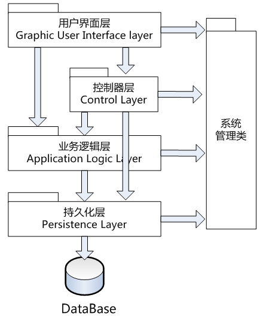

### 1.1 主要用例：前台

>  控制器：外观控制器-Server

#### 1.1.1 创建详单

| 对象设计          | CreateRDR(RoomID,date_in,date_out)                           |
| ----------------- | ------------------------------------------------------------ |
| 操作契约-后置条件 | 1. 详单对象被创建（创建一个RDR实例R)                         |
|                   | 2. 详单的所有属性被赋值（属性修改）                          |
| 设计用例实现过程  | 1. Server作为外观控制器接收系统事件CreateRDR                 |
|                   | 2. 根据操作契约，创建一个RDR实例R，Server具有创建R的职责     |
|                   | 3. 给详单所有属性赋值：根据当前服务对象的请求找到对应的房间空调使用详情，并显示 |

> 序列图：

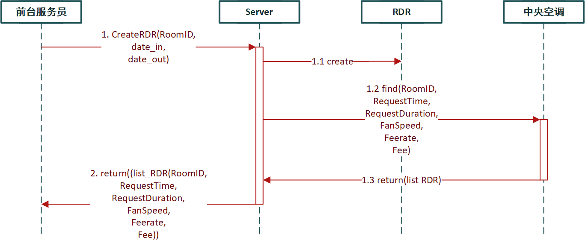

#### 1.1.2 打印详单

| 对象设计          | PrintRDR(RoomID, list RDR)                    |
| ----------------- | --------------------------------------------- |
| 操作契约-后置条件 | 1. 详单文件被创建                             |
| 设计用例实现过程  | 1. Server作为控制器接收系统事件PrintRDR       |
|                   | 2. 根据操作契约，找到对应的详单文件，打印出来 |

> 序列图：

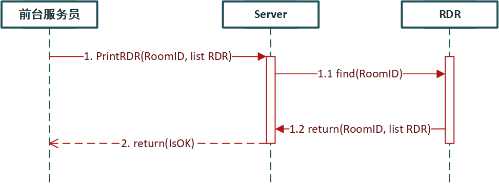

#### 1.1.3 创建账单

| 对象设计          | CreateInvoice()                                              |
| ----------------- | ------------------------------------------------------------ |
| 操作契约-后置条件 | 1. 账单对象被创建（创建一个Invoice实例I）                    |
|                   | 2. 账单对象的所有属性被赋值（属性修改）                      |
| 设计用例实现过程  | 1. 外观控制器Server接收系统事件CreateInvoice                 |
|                   | 2. 根据操作契约创建一个Invoice实例I，Server具有创建I的职责   |
|                   | 3. 给账单所有属性赋值：根据当前服务对象的请求找到对应的房间使用情况，并显示 |

> 序列图：

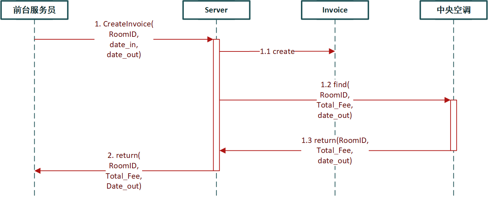

#### 1.1.4 打印账单

| 对象设计          | PrintInvoice(RoomID)                                         |
| ----------------- | ------------------------------------------------------------ |
| 操作契约-后置条件 | 1. 账单文件被创建                                            |
| 设计用例实现过程  | 1. 外观控制器Server接收系统事件PrintInvoice                  |
|                   | 2. 根据操作契约，账单文件被创建，即将对应要求的账单作为文件输出打印 |

> 序列图：

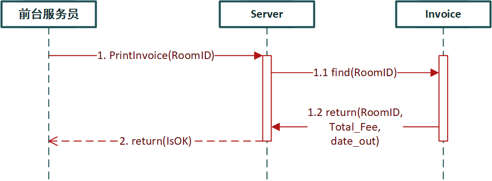

### 1.2 主要用例：酒店经理

> 控制器：外观控制器-Server

#### 1.2.1 查看报表

| 对象设计          | ReportQuery(ID_Room_List,Time_Frame,Type_Report=daily) |
| ----------------- | ------------------------------------------------------ |
| 操作契约-后置条件 | 1. 创建统计对象实例（实例创建）                        |
|                   | 2. 统计对象和Server建立关联（关联形成）                |
|                   | 3. 初始化统计对象的属性（属性修改）                    |
|                   | 4. 创建报表实例（实例创建）                            |
|                   | 5. 报表和统计对象建立关联（关联形成）                  |
|                   | 6. 修改报实例的属性（属性修改）                        |
| 设计用例实现过程  | 1. 外观控制器Server接收系统事件ReportQuery             |
|                   | 2. 报表实例被创建，并修改其属性                        |
|                   | 3. 返回报表信息                                        |

> 序列图：

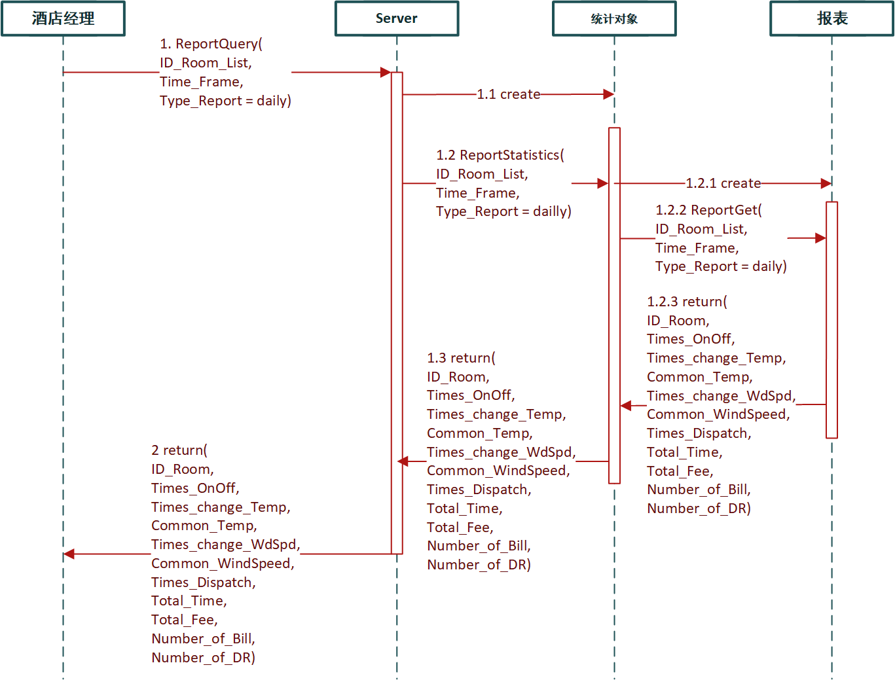

#### 1.2.2 导出报表

| 对象设计          | ReportExport(ID_Report, Time_Frame)               |
| ----------------- | ------------------------------------------------- |
| 操作契约-后置条件 | 1. 生成格式化统计报表文件                         |
| 设计用例实现过程  | 1. 外观控制器Server接收系统事件ReportExport       |
|                   | 2. 统计对象检查报表统计记录                       |
|                   | 3. 根据检查到的报表统计记录生成格式化统计报表文件 |

> 序列图：

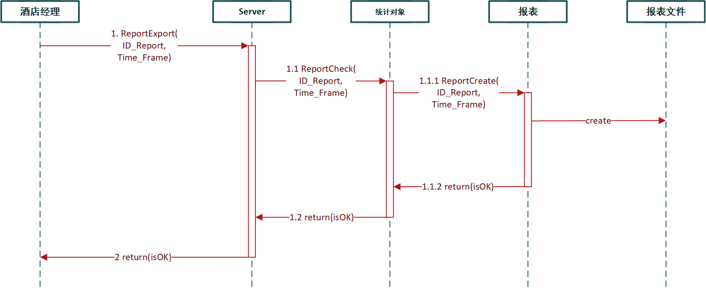

### 1.3 主要用例：空调管理员

> 控制器：外观控制器-Server

#### 1.3.1 创建空调

| 对象设计          | makeAirConditioner()                                         |
| ----------------- | ------------------------------------------------------------ |
| 操作契约-后置条件 | 1. 创建空调实例a                                             |
|                   | 2. a 和 Server建立关联                                       |
|                   | 3. 初始化 a 的属性，空调模式、温度范围、缺省温度、费率和房间号 |
| 设计用例实现过程  | 1. 外观控制器Server接收系统事件makeAirConditioner            |
|                   | 2. 根据操作契约，创建一些列AirConditioner实例a，Server具有创建a的职责 |
|                   | 3. AirConditioner与Server形成缺省的关联关系                  |
|                   | 4. 初始化a，使得该实例能记录空调模式、温度范围、缺省温度、费率和房间号 |

> 序列图：

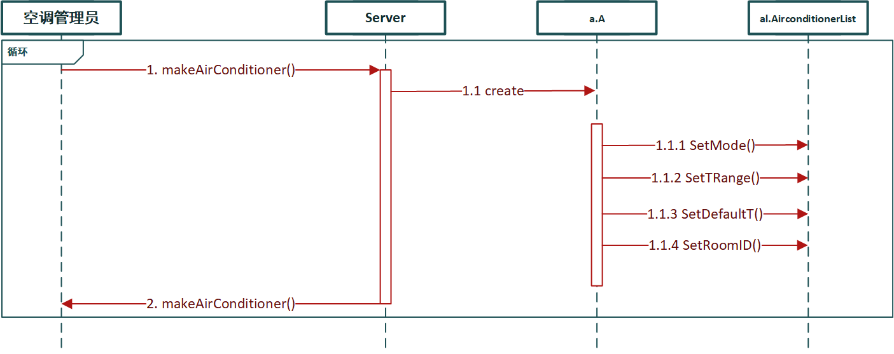

#### 1.3.2 查询监控

| 对象设计          | GetType(RoomIDList)                                      |
| ----------------- | -------------------------------------------------------- |
| 操作契约-后置条件 | 1. 系统管理员与clock建立关联，若满一分钟则查询，否则等待 |
| 设计用例实现过程  | 1. 外观控制器Server接收系统事件GetType                   |
|                   | 2. clock与Server建立关联                                 |
|                   | 3. 获取AirConditioner的状态信息等                        |

> 序列图：

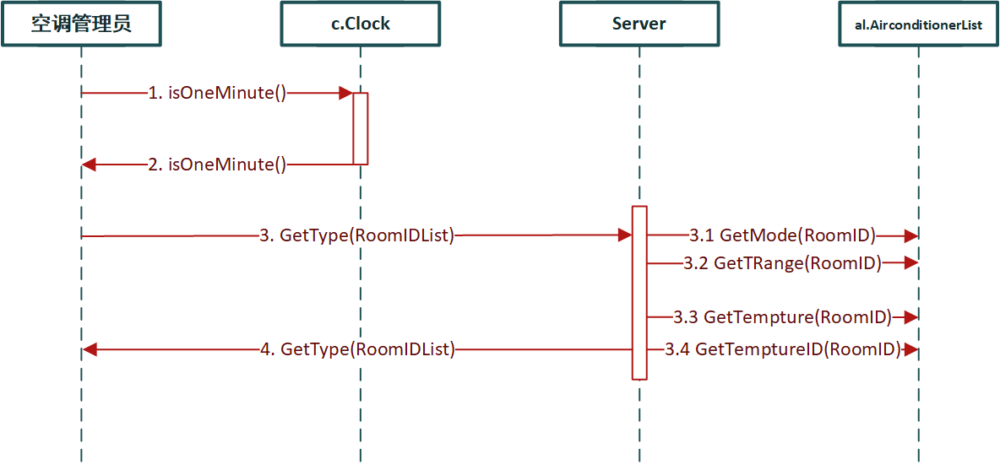

### 1.4 主要用例：最终用户

> 控制器：外观控制器-Server

#### 1.4.1 启动空调

| 对象设计          | BootAirConditioner(RoomID)                                   |
| ----------------- | ------------------------------------------------------------ |
| 操作契约-后置条件 | 1. Service服务对象创建一个ServiceItem实例si                  |
|                   | 2. 初始化sli的属性                                           |
|                   | 3. sli添加到ServiceLine或WaitLine队列中                      |
| 设计用例实现过程  | 1. 外观控制器Server接收事件BootAirConditioner                |
|                   | 2. 资源管理对象判断当前服务队列ServiceLine是否有资源，并告知Service服务对象 |
|                   | 3. Service服务对象负责创建新的ServiceLineItem实例sli并初始化 |
|                   | 4. Service根据当前资源使用情况将新的实例sli添加到ServiceLine或WaitLine队列中 |

> 序列图如下：

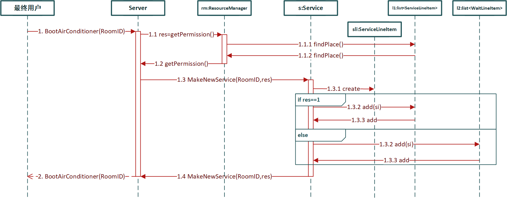

#### 1.4.2 更改温度&风速&模式

| 对象设计          | ChangeInfo(RoomID,targetTemp,targetWindSpeed,mode)           |
| ----------------- | ------------------------------------------------------------ |
| 操作契约-后置条件 | 1. 对应房间的ServiceItem实例sli的属性改变                    |
| 设计用例实现过程  | 1. 外观控制器Server接收系统事件ChangeWindAndTemp             |
|                   | 2. ResourceManager对象根据目标房间ID从ServiceLine和WaitLine中取出对应实例sli |
|                   | 3. ResourceManager对象修改实例sli的目标温度、目标风速或模式  |
|                   | 4. ResourceManager对象根据调度规则将更改后的实例sli插入到ServiceLine或WaitLine队列中 |

> 序列图如下：

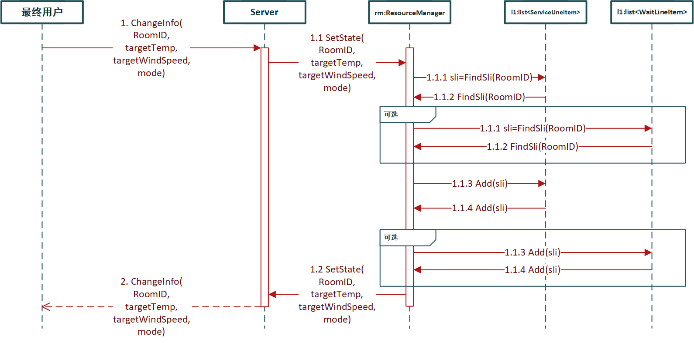

#### 1.4.3 查看账单

| 对象设计          | ShowBill(RoomID)                                             |
| ----------------- | ------------------------------------------------------------ |
| 操作契约-后置条件 | 1. 获取对应房间ID的空调使用及消费情况                        |
| 设计用例实现过程  | 1. 外观控制器Server接收系统事件ShowBill                      |
|                   | 2. Accountant对象根据目标房间ID在ServiceLine队列中找到实例sli |
|                   | 3. 返回该实例的信息                                          |

> 序列图如下：

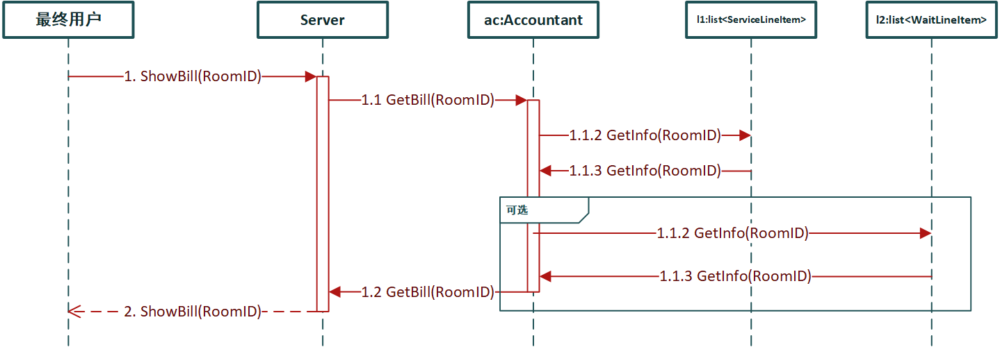

#### 1.4.4 关闭空调

| 对象实例          | AirConditionerOff(RoomID)                         |
| ----------------- | ------------------------------------------------- |
| 操作契约-后置条件 | 1. 房间的服务实例从队列中移除                     |
| 设计用例实现过程  | 1. 外观控制器Server接收系统事件AirConditionerOff  |
|                   | 2. ResourceManager找到对应的实例sli并从队列中移除 |

> 序列图：

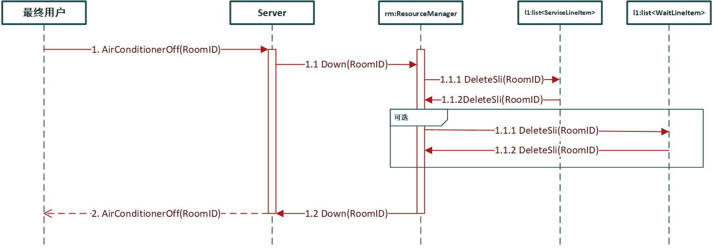